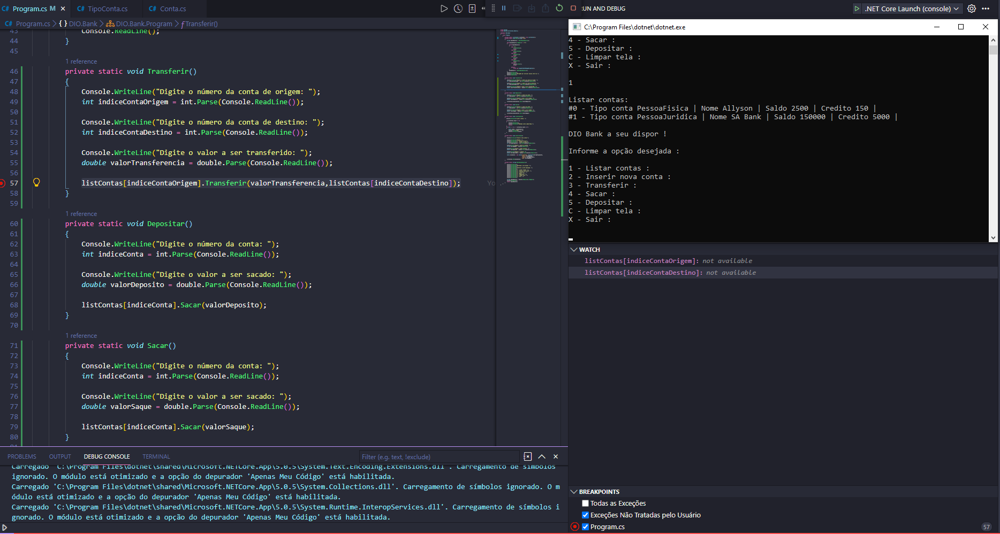

# NET Bank Tranfer

Criado aplicação bancária com a linguagem C# para fins educativos de testes entre e metodos com Visual Studio Code.Como pensar orientado a objetos, como modelar o seu domínio, como utilizar enums.

    

    
Projeto desenvolvido com o instrutor<a href="https://www.linkedin.com/in/eliezerzarpelao/"> Eliézer Zarpelão</a> com a Digital Innovation One.

